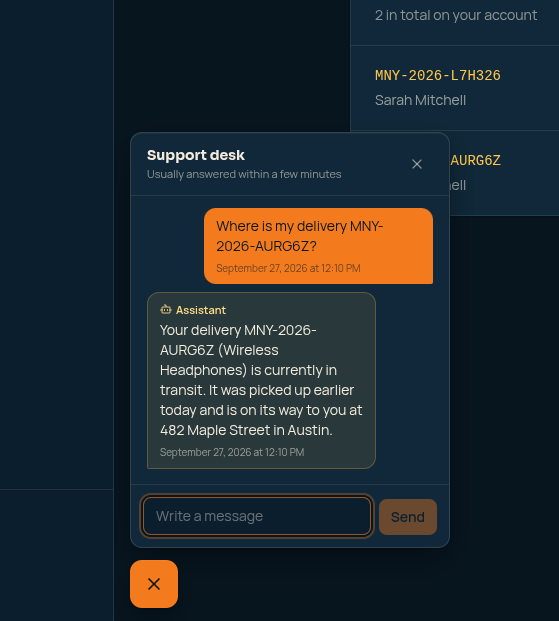

# Moonery Frontend


The single-page app of **Moonery**, a delivery management platform. One codebase serves four kinds of user, and each one only sees what their permissions allow.

> **Running it?** Start from the [`infra` repository](https://github.com/moonery-system/infra#readme): the frontend container runs with the rest of the stack at http://localhost:8082.

## What you can do in it

| Area | What it offers |
|---|---|
| **Deliveries** | List with pagination, create with client, address and items, and a detail page with a **status timeline** and **one button per legal next status** (the buttons come from the API, so the UI can never offer an illegal move) |
| **Clients & addresses** | Register clients and manage their addresses |
| **Users** | Create, edit and invite users; the invite e-mail leads to the password-setup screen |
| **Notifications** | A bell with an unread count and a live toast, updated over WebSocket |
| **Support chat** | A floating chat for every signed-in user, and a support inbox with unread counts |
| **AI assistant** | Inside the chat: confirmation cards for cancelling, a "replying…" indicator, and a hand-off banner |

## Screenshots

<table>
<tr>
<td width="50%">

**Admin overview**


</td>
<td width="50%">

**Delivery detail, as the delivery man** — one button per status the API allows next, plus the full timeline


</td>
</tr>
<tr>
<td width="50%">

**The assistant answering a status question**


</td>
<td width="50%">

**The cancellation confirmation card**


</td>
</tr>
<tr>
<td width="50%">

**Support desk**, after the customer confirmed the cancellation


</td>
<td width="50%"></td>
</tr>
</table>

## Design decisions

- **Permission-driven UI.** A `PermissionGuard` component and route metadata hide what a user may not use. Permissions accept wildcards (`clients.*`). The UI is a convenience; the API is still the one that enforces.
- **A resilient API client** (`services/api.ts`): errors are normalized to `{ status, message, errors }`, and a `401` triggers **one** refresh and a retry. Auth calls are excluded from that loop, otherwise a refresh that calls `/auth/user` would hang the app.
- **In-flight request de-duplication**: several components asking "who am I?" at once share one request (it used to be three per page load).
- **Live updates without polling for the basics.** A small WebSocket client with reconnection backoff feeds notifications and chat.
- **Assistant logic lives outside the components.** The trickiest part, the confirmation card, is a small state machine in a composable with **no HTTP and no DOM** (the calls are passed in), so it is unit-testable:
  - `useAssistantConfirmation`: states `pending → submitting → confirmed | rejected | expired | refused | network_error`. It expires on a timer, retries the *same* intent after a network error, and the server has the last word **only when it brings news** (a stale "still pending" reload does not erase a local error).
  - `useAssistantWaiting`: derives "the assistant is replying…" from the data (my message is the last one and the assistant is active), with a 45-second limit and a safety re-fetch, instead of trusting a single event that could be lost.
  - `singleFlight`: a burst of pushes becomes one refetch.
- **Announced to assistive tech where it matters**: the assistant's status (replying, timed out, handed off) lives in an `aria-live` region.
- **Purge-safe Tailwind**: status colors are written out in full, because class names built at runtime would be removed from the production build.

## Tests

```bash
npm run test:unit      # 96 tests (Jest + ts-jest)
npm run lint           # 0 errors
```

- The **96 unit tests cover the TypeScript logic** (composables and utils): the confirmation state machine, expiry timers, double clicks, network errors, the waiting indicator and the refetch coalescing.
- **`.vue` components are not covered yet**, only the logic they use. That is a deliberate first step, not a claim of full coverage.
- The assistant flow also has a manual test script with seeded data: [`docs/assistant-manual-test.md`](docs/assistant-manual-test.md).
- Worth knowing: `build` and `lint` do **not** type-check the `.vue` templates in this Vue CLI setup, so the type-safety net is the TypeScript logic plus review.

## Run it

```bash
# environment (frontend/.env)
VUE_APP_API_URL=http://localhost/api
VUE_APP_WS_URL=ws://localhost:9502

npm install
npm run serve          # http://localhost:8082, hot reload
npm run build          # production build
```

The UI text is in **English**, like the rest of the codebase. Seeded logins for the four roles are in the [infra README](https://github.com/moonery-system/infra#seeded-logins-development-only).

## Stack

Vue 3 · TypeScript 4.5 · Vue Router 4 · Axios · Tailwind CSS 3 · Vue CLI · Jest 27.
